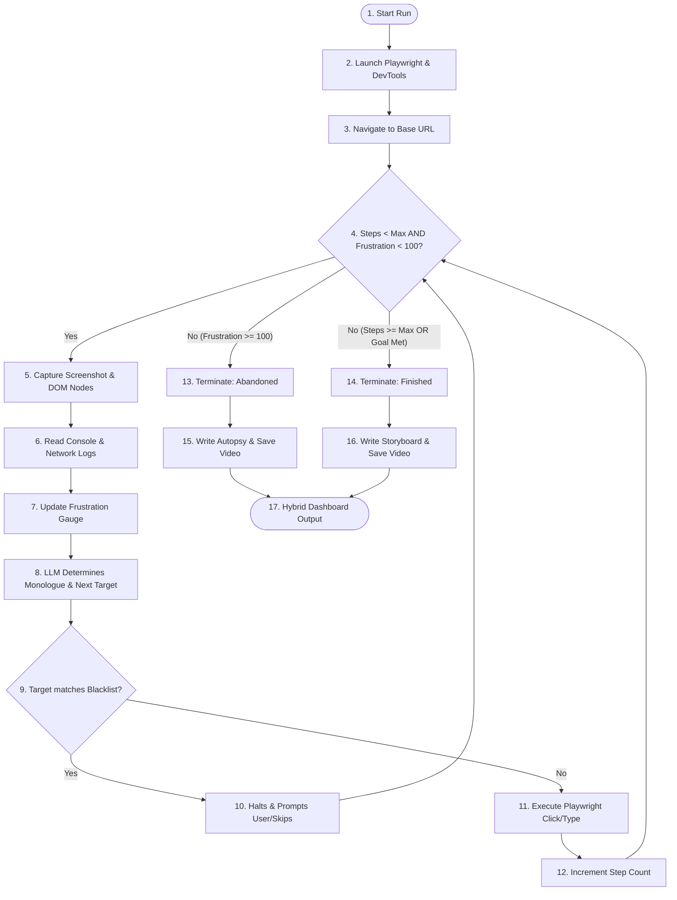

# App Flow Mapping - User Bro Global Agent

This document diagrams the execution states, navigation paths, and edge cases handled by the User Bro agent.

---

## 1. Core Execution Loop

Below is the state transitions diagram mapping the lifecycle of a single test session.

---

## 2. Navigation Scenarios & Edge Cases

### 2.1 Scenario 1: Standard Path (Frustration Remains Low)
1. User Bro launches with Goal: "Add item to cart and click checkout".
2. Navigates to e-commerce storefront.
3. Steps through product selection and click-to-cart operations seamlessly.
4. Console/network checks return 200 OK and no JS exceptions.
5. Frustration remains below 20.
6. Execution terminates successfully; storyboard report created.

### 2.2 Scenario 2: Aborted Path (Frustration Hits 100)
1. User Bro launches with Goal: "Submit feedback form".
2. Fills out form but misses a required, unmarked field (naive behavior).
3. Clicks "Submit". Form does not submit and page shows no visual changes or messages (bad UX).
4. Frustration increases: `+20` (No visual change).
5. Agent clicks "Submit" again. Still no change: `+20` (No visual change, total: 40).
6. Agent gets lost, tries to click unrelated navigation links, but console logs throw exceptions: `+30` (Console error, total: 70).
7. Slow server response: `+30` (Slow API, total: 100).
8. Frustration hits 100. Execution halts immediately.
9. Report status set to `ABANDONED`. "Autopsie de la Frustration" is generated detailing the bad validation UX and API lag.

### 2.3 Scenario 3: Guardrail Triggered (Blacklist Detection)
1. Agent decides to click "Supprimer le profil".
2. Security guardrail module intercepts the action because the string matches `/supprimer|delete/i`.
3. Agent halts navigation.
4. Prompt is generated in the CLI console:
   `[GUARDRAIL ALERT] User Bro wants to click a destructive button: 'Supprimer le profil'. Allow? (y/n/skip)`
5. If user enters `y`: Execute click.
6. If user enters `n`/`skip`: Record as "Action à risque évitée" in report, choose alternative element, and continue.
