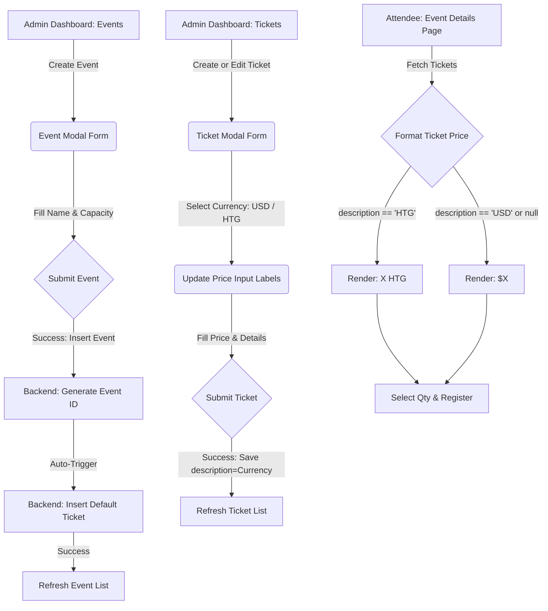

# App Flow Mapping - Ticket Currency & Automatic Ticket Creation

## 1. User Journeys & State Routing

## 2. Detailed Navigation Loops

### Event Creation Loop
1. **Starting Point**: Admin is on `/admin/events`.
2. **Action**: Admin clicks the "+ Créer un événement" button.
3. **Transition**: Modal overlay opens. Admin fills out the event name, description, date/time, and **Capacity** (e.g., `250`).
4. **Execution**: Admin clicks "Créer". 
   - Step 4.1: Database inserts the event.
   - Step 4.2: Retrieve the newly created event's UUID.
   - Step 4.3: Automatically execute an insert query for a default standard ticket linked to the event UUID, with quantity = `250` and currency = `'USD'` (stored in description).
5. **Success State**: Modal closes. The table refreshes. The event is visible, and the default ticket is already active.

### Ticket Customization Loop
1. **Starting Point**: Admin is on `/admin/tickets`.
2. **Action**: Admin clicks the edit button on any ticket, or "+ Créer un type de billet".
3. **Transition**: Modal overlay opens.
4. **Configuration**: Admin chooses the currency toggle (USD or HTG).
   - If USD is active: Price text fields display `$` helper tags.
   - If HTG is active: Price text fields display `HTG` helper tags.
5. **Execution**: Admin saves. The client sends the selected currency string (either `'USD'` or `'HTG'`) inside the `description` column.
6. **Success State**: Modal closes. The admin table updates, displaying formatted prices (e.g., `1 500 HTG` or `$15`).

### Public Attendee Booking Journey
1. **Starting Point**: Public user opens `/events/[id]`.
2. **Details**: The page queries all tickets associated with the event.
3. **Render**: The ticket options are presented. Prices are formatted via `formatPrice` so that a user sees `Gratuit`, `$25` or `2 500 HTG` according to the ticket configuration.
4. **Action**: User selects their tickets, inputting quantities, and clicks "S'inscrire".
5. **Redirection**: Redirects to the checkout/reservations manager with the correct parameters.
