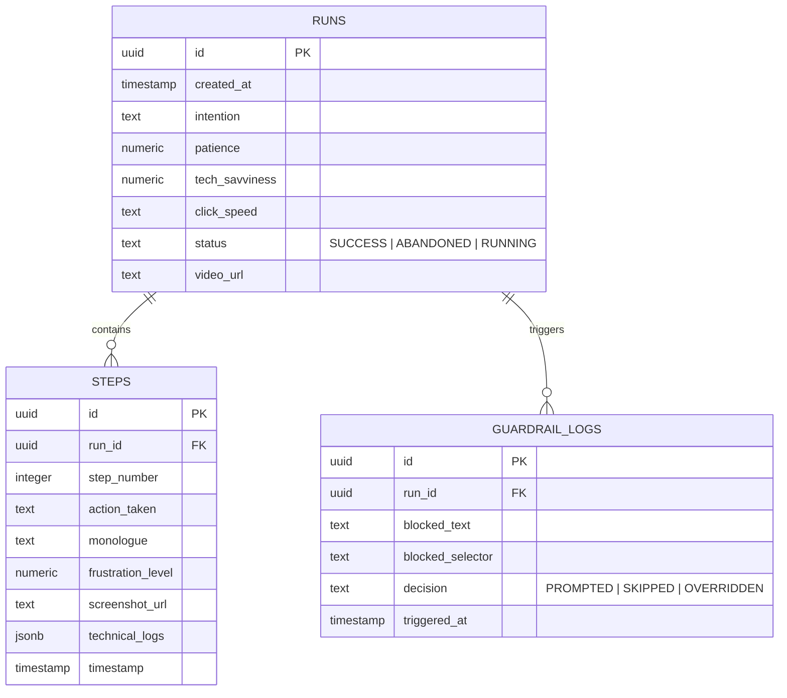

# Backend Schema - User Bro Global Agent

This document defines the relational database schema (designed for PostgreSQL/Supabase) to persist User Bro test sessions, step-by-step logs, and security events.

---

## 1. Relational Database Schema



---

## 2. DDL SQL Specifications

```sql
-- Enable UUID extension
CREATE EXTENSION IF NOT EXISTS "uuid-ossp";

-- 1. Runs Table
CREATE TABLE public.user_bro_runs (
    id UUID PRIMARY KEY DEFAULT uuid_generate_v4(),
    created_at TIMESTAMP WITH TIME ZONE DEFAULT timezone('utc'::text, now()) NOT NULL,
    intention TEXT NOT NULL,
    patience NUMERIC(3, 2) NOT NULL CHECK (patience >= 0.0 AND patience <= 1.0),
    tech_savviness NUMERIC(3, 2) NOT NULL CHECK (tech_savviness >= 0.0 AND tech_savviness <= 1.0),
    click_speed VARCHAR(10) NOT NULL CHECK (click_speed IN ('slow', 'normal', 'fast')),
    status VARCHAR(15) NOT NULL DEFAULT 'RUNNING' CHECK (status IN ('RUNNING', 'SUCCESS', 'ABANDONED')),
    video_url TEXT
);

-- 2. Steps Table
CREATE TABLE public.user_bro_steps (
    id UUID PRIMARY KEY DEFAULT uuid_generate_v4(),
    run_id UUID REFERENCES public.user_bro_runs(id) ON DELETE CASCADE NOT NULL,
    step_number INTEGER NOT NULL CHECK (step_number >= 0),
    action_taken TEXT NOT NULL,
    monologue TEXT NOT NULL,
    frustration_level INTEGER NOT NULL CHECK (frustration_level >= 0 AND frustration_level <= 100),
    screenshot_url TEXT NOT NULL,
    technical_logs JSONB DEFAULT '{}'::jsonb NOT NULL,
    timestamp TIMESTAMP WITH TIME ZONE DEFAULT timezone('utc'::text, now()) NOT NULL,
    UNIQUE (run_id, step_number)
);

-- 3. Guardrail Logs Table
CREATE TABLE public.user_bro_guardrail_logs (
    id UUID PRIMARY KEY DEFAULT uuid_generate_v4(),
    run_id UUID REFERENCES public.user_bro_runs(id) ON DELETE CASCADE NOT NULL,
    blocked_text TEXT NOT NULL,
    blocked_selector TEXT NOT NULL,
    decision VARCHAR(15) NOT NULL CHECK (decision IN ('PROMPTED', 'SKIPPED', 'OVERRIDDEN')),
    triggered_at TIMESTAMP WITH TIME ZONE DEFAULT timezone('utc'::text, now()) NOT NULL
);

-- Indexes for performance
CREATE INDEX idx_user_bro_steps_run_id ON public.user_bro_steps(run_id);
CREATE INDEX idx_user_bro_guardrail_run_id ON public.user_bro_guardrail_logs(run_id);
```

---

## 3. Security & Row-Level Security (RLS) Policies

All tables are protected under Supabase/PostgreSQL Row-Level Security policies to ensure only authenticated developers can view or insert test session logs.

```sql
-- Enable RLS
ALTER TABLE public.user_bro_runs ENABLE ROW LEVEL SECURITY;
ALTER TABLE public.user_bro_steps ENABLE ROW LEVEL SECURITY;
ALTER TABLE public.user_bro_guardrail_logs ENABLE ROW LEVEL SECURITY;

-- 1. Runs Access Policies
CREATE POLICY "Allow authenticated read runs" 
    ON public.user_bro_runs FOR SELECT 
    TO authenticated 
    USING (true);

CREATE POLICY "Allow authenticated insert runs" 
    ON public.user_bro_runs FOR INSERT 
    TO authenticated 
    WITH CHECK (true);

-- 2. Steps Access Policies
CREATE POLICY "Allow authenticated read steps" 
    ON public.user_bro_steps FOR SELECT 
    TO authenticated 
    USING (true);

CREATE POLICY "Allow authenticated insert steps" 
    ON public.user_bro_steps FOR INSERT 
    TO authenticated 
    WITH CHECK (true);

-- 3. Guardrail Logs Access Policies
CREATE POLICY "Allow authenticated read guardrails" 
    ON public.user_bro_guardrail_logs FOR SELECT 
    TO authenticated 
    USING (true);

CREATE POLICY "Allow authenticated insert guardrails" 
    ON public.user_bro_guardrail_logs FOR INSERT 
    TO authenticated 
    WITH CHECK (true);
```
